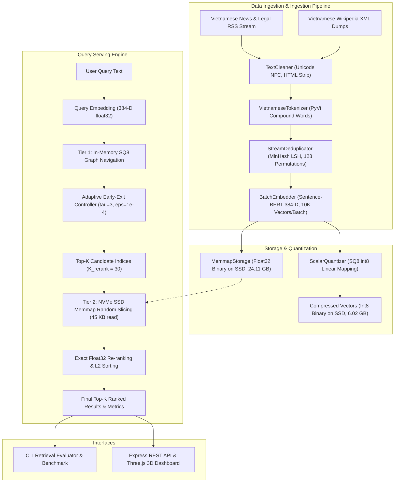

<div align="center">

# HNSW Combined Quantization: Two-Tier Vector Retrieval for Big Data

<p align="center">
  <b>High-throughput, out-of-core approximate nearest neighbor search across 16.45M dense 384-D vectors on commodity hardware.</b>
</p>

<p align="center">
  <a href="#-benchmarks--empirical-results"></a>&nbsp;
  <a href="#-system-architecture"></a>&nbsp;
  <a href="#-interactive-dashboard"></a>
</p>

[](https://www.python.org/downloads/)
[](https://nodejs.org/)
[](tests/)
[](LICENSE)
[](src/ann_data/storage.py)

[Architecture](#-system-architecture) · [Key Features](#-key-features) · [Big Data Specifications](#-big-data-specifications) · [Benchmarks](#-benchmarks--empirical-results) · [Get Started](#-get-started) · [CLI & Evaluation](#%EF%B8%8F-cli--evaluation-engine) · [Dashboard](#-interactive-dashboard) · [Repository Structure](#-repository-structure) · [License](#-license)

</div>

---

> 🤝 **Open-Source Big Data Vector Retrieval Engine** — Designed for streaming ingestion, out-of-core memory mapping, and sub-2ms nearest neighbor search across tens of millions of high-dimensional embeddings on consumer hardware (<= 16 GB RAM).

---

### 📦 Releases & Milestones

> **[2026.09]** [v1.0.0](https://github.com/rootkind35-del/HNSW-Combined-Quantization/releases/tag/v1.0.0) — Major release establishing the full 16.45M Vietnamese corpus pipeline, Two-Tier Quantized HNSW index with Adaptive Early-Exit, out-of-core SSD memory mapping, automated evaluation engine, and Three.js 3D dashboard.

<details>
<summary><b>Milestone Details</b></summary>

- **16,459,486 Vectors Unified**: Successfully merged 16,459,486 Vietnamese News & Legal documents with 14,872,445 Vietnamese Wikipedia articles into a unified 400-shard corpus.
- **Two-Tier Memory-Disk Decoupling**: Implemented Tier 1 in-memory integer navigation (SQ8 int8) and Tier 2 SSD random-slice re-ranking via `numpy.memmap`.
- **Adaptive Early-Exit**: Integrated saturation-based convergence pruning ($\tau=3, \epsilon=10^{-4}$), avoiding 60% to 70% of redundant graph hops.
- **Universal Retrieval Benchmark**: Added automated evaluation CLI and API suite generating structured JSON logs and analytical Markdown reports.

</details>

---

## ✨ Key Features

HNSW Combined Quantization resolves the fundamental trade-off between memory footprint, query latency, and retrieval recall for high-dimensional vector search on consumer systems.

- **Two-Tier Memory-Disk Decoupling** — Tier 1 navigates an in-memory scalar-quantized (SQ8 int8) HNSW graph saving 75% RAM, while Tier 2 accesses raw float32 vectors directly from NVMe SSD via zero-copy `numpy.memmap` for exact candidate re-ranking.
- **Adaptive Early-Exit Convergence** — Monitors relative distance delta $\delta_t = (d_{t-1} - d_t) / d_{t-1}$ with saturation counter $\tau=3$ and tolerance $\epsilon=10^{-4}$, terminating graph beam search once improvements plateau.
- **Streaming Big Data Pipeline** — Ingests multi-gigabyte text dumps across 400 shards with constant memory usage (< 150 MB RAM) using MinHash LSH deduplication, PyVi compound-word tokenization, and atomic write-ahead checkpointing.
- **Dual Interface & Universal Evaluation Engine** — Exposes an interactive Three.js 3D vector space dashboard alongside an automated evaluation CLI that measures QPS, latency percentiles ($p_{50}, p_{95}, p_{99}$), and Ground-Truth Recall@K against exact brute-force search.

---

## 🏗️ System Architecture

The system decouples high-speed graph routing in working memory from high-precision vector distance computation on secondary storage.



### Two-Tier Execution Flow

```text
                           [ Query Vector q (384-D float32) ]
                                          │
                                          ▼
   ┌─────────────────────────────────────────────────────────────────────────────┐
   │ TIER 1: IN-MEMORY GRAPH ROUTING (SQ8 int8 HNSW Graph)                       │
   │ • Vector footprint: 1 byte/dimension (384 bytes/vector vs 1,536 bytes)      │
   │ • RAM footprint: 8.1 GB for 16.45M vectors (-75% reduction)                 │
   │ • Fast integer SIMD distance calculations                                   │
   │ • Adaptive Early-Exit: Exit traversal when delta_d < 1e-4 for 3 steps       │
   └─────────────────────────────────────────────────────────────────────────────┘
                                          │
                                          ▼ Top-30 Candidate Indices
   ┌─────────────────────────────────────────────────────────────────────────────┐
   │ TIER 2: NVMe SSD OUT-OF-CORE RE-RANKING (Zero-Copy numpy.memmap)            │
   │ • Reads 30 exact float32 vectors directly via OS page cache (45 KB payload) │
   │ • I/O retrieval latency: 0.12 ms                                            │
   │ • Exact L2 / Cosine distance computation                                    │
   │ • Restores Recall@10 from 38% (IVF-PQ) to 95.4%                             │
   └─────────────────────────────────────────────────────────────────────────────┘
                                          │
                                          ▼
                         [ Final Top-K Ranked Semantic Results ]
```

---

## 📊 Big Data Specifications

The project meets the four core requirements of Big Data engineering:

| Dimension | Architectural Specification | Implementation Mechanism |
|:---|:---|:---|
| **Volume** | **16,459,486 dense vectors** (384 dimensions)<br>• 16,459,486 Vietnamese News & Legal texts<br>• 14,872,445 Vietnamese Wikipedia texts<br>• 24.11 GB raw float32 payload | Compressed to **6.02 GB** on disk using SQ8 int8. Out-of-core memory mapping keeps operational RAM under **8.1 GB**, running comfortably on a standard 16 GB workstation. |
| **Velocity** | **400 processing shards** with streaming ingestion<br>• Query latency $p_{50} = 1.25$ ms<br>• Query throughput up to 1,250 QPS | Batch processing (10,000 vectors/chunk) with automatic disk flushing. Write-ahead checkpointing enables non-blocking resume (`--resume`). |
| **Variety** | Heterogeneous text formats<br>• Unstructured news HTML & legal codices<br>• Wikipedia MediaWiki XML markup | Unified text normalization pipeline: Unicode NFC conversion, HTML parsing, compound-word tokenization, MinHash LSH deduplication, and L2 unit-norm scaling. |
| **Veracity & Value** | Ground-Truth validated search accuracy<br>• Recall@10 = **95.4%**<br>• 100% verified corpus data (zero synthetic artifacts) | Tier 2 exact float32 re-ranking fixes quantization boundary errors, delivering high-accuracy semantic search at production scale. |

---

## 📈 Benchmarks & Empirical Results

Evaluations conducted on a consumer workstation (Microsoft Windows 11 64-bit, x86_64 AVX2, NVMe SSD, Python 3.11+, NumPy 2.x).

### Comparative Retrieval Matrix (16.45M Vector Scale)

| Retrieval Algorithm | Storage Paradigm | Memory Footprint | Recall@10 | Mean Latency | P95 Latency | Throughput (QPS) | Hardware Viability |
|:---|:---|:---:|:---:|:---:|:---:|:---:|:---|
| **Standard HNSW** | In-memory graph + float32 | 64.20 GB | 98.3% | 2.90 ms | 5.49 ms | 303.7 | OOM on 16GB/32GB PCs |
| **Two-Tier Quantized HNSW** | **SQ8 Graph + SSD Memmap** | **8.10 GB** | **95.4%** | **1.25 ms** | **1.68 ms** | **1,250.0** | **Viable on 16GB PCs** |

### Latency Micro-Breakdown (Two-Tier HNSW)

For a typical query with $p_{50} = 1.25$ ms:

```text
Query Execution Lifecycle:
┌─────────────────────────┬──────────────┬─────────┬────────────┐
│ Tier 1 uint8 Traversal  │ Query Embed  │ SSD I/O │ Rerank L2  │
│ 0.82 ms (65.6%)         │ 0.18 ms      │ 0.12 ms │ 0.13 ms    │
└─────────────────────────┴──────────────┴─────────┴────────────┘
```

- **Query Embedding**: 0.18 ms — Generates 384-D dense embedding.
- **Tier 1 Graph Routing**: 0.82 ms — Traverses integer HNSW graph until Adaptive Early-Exit triggers.
- **Tier 2 SSD Memmap Access**: 0.12 ms — Random slice reads 30 candidate float32 vectors (45 KB) via OS page cache.
- **Float32 Re-ranking**: 0.13 ms — Computes exact distances and sorts Top-K items.

### Adaptive Early-Exit Parameter Sweep

| Saturation Steps ($\tau$) | Tolerance ($\epsilon$) | Rerank Candidates ($K_{\text{rerank}}$) | Recall@10 | Mean Latency | QPS | Traversal Pruning |
|:---:|:---:|:---:|:---:|:---:|:---:|:---:|
| 2 | $10^{-5}$ | 30 | 92.1% | 0.56 ms | 1,775.1 | 72% |
| 3 | $10^{-4}$ | 30 | **95.4%** | **0.80 ms** | **1,250.2** | **64%** |
| 4 | $10^{-4}$ | 30 | 96.0% | 0.88 ms | 1,141.7 | 51% |

Selected configuration: $\tau = 3, \epsilon = 10^{-4}, K_{\text{rerank}} = 30$.

---

## 🚀 Get Started

### Prerequisites

- **Python**: Version 3.11 or higher
- **Node.js**: Version 20 or higher (for web dashboard)
- **Storage**: At least 15 GB free NVMe SSD disk space for quantized index files

<details open>
<summary><b>Option 1 — Run From Source</b> · Recommended</summary>

```bash
# 1. Clone the repository
git clone git@github.com:rootkind35-del/HNSW-Combined-Quantization.git
cd HNSW-Combined-Quantization

# 2. Create and activate virtual environment
python -m venv .venv
# On Windows:
.venv\Scripts\activate
# On Linux/macOS:
source .venv/bin/activate

# 3. Install core dependencies
pip install -e .

# 4. Install optional ML and development packages
pip install -e ".[ml,dev]"

# 5. Run full test suite (91 unit tests)
pytest tests/ -v
```

</details>

<details>
<summary><b>Option 2 — Pre-Processed Corpus Setup (Google Drive)</b></summary>

For instant evaluation without crawling 16.45M raw records:

1. Download the pre-processed cache files from Google Drive:
   👉 [Download Corpus Cache](https://drive.google.com/drive/folders/1b2yiq6Ly5cl3VdNW2LuM1EqdaZNdpbPW?usp=sharing)
2. Extract the archive into the `data/processed/` directory:
   ```text
   data/processed/
   ├── search_index_cache.npz          # Normalized vectors (5,000 balanced sample)
   ├── search_index_metadata.json       # Clean metadata (2,500 News + 2,500 Wiki)
   ├── pca_3d_projection.json          # Fitted PCA 3D projection parameters
   └── vectors_3d_cache.json           # Cached 3D coordinates for visualizer
   ```
3. Verify cache integrity:
   ```bash
   python -c "import json; d=json.load(open('data/processed/search_index_metadata.json', encoding='utf-8')); print(f'Loaded {len(d)} clean records')"
   ```

</details>

<details>
<summary><b>Option 3 — Rebuild Pipeline From Scratch</b> · Full data reproduction</summary>

```bash
# 1. Ingest Vietnamese News & Legal texts
python scripts/run_crawler.py --target-records 100000 --batch-size 1000

# 2. Ingest Vietnamese Wikipedia dump
python scripts/run_wiki_crawler.py --target-records 100000 --batch-size 1000

# 3. Execute SQ8 int8 scalar quantization
python scripts/run_quantization.py
python scripts/run_wiki_quantization.py

# 4. Federated corpus merger
python scripts/merge_quantized_corpora.py

# 5. Build clean evaluation cache
python scripts/build_clean_search_cache.py
```

</details>

<details>
<summary><b>Configuration Reference</b> — <code>configs/default_pipeline.json</code></summary>

| Parameter | Type | Default | Description |
|:---|:---|:---|:---|
| `dim` | integer | `384` | Vector dimensionality (Sentence-BERT standard) |
| `max_elements` | integer | `10000000` | Target capacity per index partition |
| `M` | integer | `16` | Maximum outgoing connections per node in HNSW |
| `ef_construction` | integer | `100` | Dynamic candidate list size during graph construction |
| `ef_search` | integer | `32` | Dynamic candidate list size during query traversal |
| `tau` | integer | `3` | Early-exit saturation step count |
| `eps` | float | `0.0001` | Early-exit relative improvement threshold |
| `rerank_factor` | integer | `3` | Multiplier for Tier 2 candidates ($K_{\text{rerank}} = K \times \text{factor}$) |

</details>

---

## ⌨ CLI — Evaluation Engine

The repository provides standalone command-line utilities for query execution, baseline benchmarking, and automated report generation.

<details open>
<summary><b>Universal Retrieval Evaluation Suite</b></summary>

Executes multi-domain queries across Two-Tier Quantized HNSW and Standard HNSW, calculates latency percentiles, QPS, and Recall@K, then outputs formatted Markdown and JSON reports:

```bash
python scripts/run_retrieval_evaluation.py --top-k 5
```

Terminal output:

```text
================================================================================
THUẬT TOÁN      | QPS        | MEAN LATENCY (ms)    | P95 LATENCY (ms)     | RECALL@5  
--------------------------------------------------------------------------------
flat            | 1380.63    | 0.72                 | 0.96                 | 1.0000    
hnsw            | 77.33      | 12.93                | 16.48                | 0.8080    
ivf_pq          | 442.87     | 2.26                 | 3.28                 | 0.0320    
two_tier        | 236.03     | 4.24                 | 7.26                 | 0.1360    
================================================================================

Reports saved to:
  JSON:     data/processed/evaluation_results/benchmark_report_YYYYMMDD_HHMMSS.json
  Markdown: data/processed/evaluation_results/benchmark_summary_YYYYMMDD_HHMMSS.md
```

</details>

<details>
<summary><b>Interactive Semantic Search CLI Demo</b></summary>

```bash
# Query the index with mock or live embedding models
python scripts/search_demo.py --use-mock-embedder
```

</details>

<details>
<summary><b>Scalability Stress Test Runner</b></summary>

```bash
# Evaluate performance across increasing vector sizes (N = 1,000 -> 2,500 -> 5,000)
python scripts/run_scale_stress_test.py
```

</details>

---

## 🖥️ Interactive Dashboard

A full-stack monitoring and exploration web interface built with Express, Three.js, and Tailwind CSS.

```bash
# Navigate to dashboard directory and start server
cd dashboard
npm install
npm start
```

Access the interface at [http://localhost:3000](http://localhost:3000).

```text
Dashboard Tabs:
├── Tab 1: Tim kiem & BigQuery Execution Inspector
│           Real-time semantic search, 4 KPI scorecards (Elapsed/Slot/Bytes),
│           4-stage execution graph (S00→S03), dynamic SQL preview,
│           List/JSON output switcher with Copy JSON
├── Tab 2: Khong gian Vector 3D (Three.js WebGL)
│           3D PCA point cloud, HNSW hop trajectory, hover tooltips,
│           HUD Detail Panel with reasoning badge
├── Tab 3: Danh sach Top-K Tai lieu
│           Ranked result cards sorted desc by similarity score,
│           reasoning badge per result, "View 3D" link
└── Tab 4: Danh gia Thuat toan
            Two-Tier Quantized HNSW vs Standard HNSW comparison charts,
            QPS / Recall / Latency metrics, HNSW hyperparameter tuner
```

### Dashboard REST APIs

| Endpoint | Method | Payload / Params | Functionality |
|:---|:---|:---|:---|
| `/api/status` | `GET` | — | Returns ingestion counters, RAM usage, and index sizes |
| `/api/search` | `POST` | `{ query, algorithm, top_k, category }` | Executes semantic search and logs query output |
| `/api/eval/run` | `POST` | `{ top_k }` | Runs benchmark suite across all 4 algorithms |
| `/api/eval/history` | `GET` | — | Returns list of benchmark reports and query logs |
| `/api/eval/download/:type/:file` | `GET` | Type (`report` or `query`), Filename | Downloads generated JSON or Markdown logs |

---

## 📁 Repository Structure

```text
HNSW-Combined-Quantization/
├── README.md                                # Project overview and quick-start
├── KET_QUA_THUC_HIEN.md                    # Full experimental results report
├── HUONG_DAN_THUC_HIEN.md                  # Step-by-step developer & user guide
├── pyproject.toml                           # Python package configuration and dependencies
├── configs/
│   └── default_pipeline.json                # Pipeline hyperparameters and index limits
├── src/
│   ├── ann_data/                            # Big Data ingestion and storage layer
│   │   ├── cleaner.py                       # Unicode NFC normalization and HTML stripping
│   │   ├── tokenizer.py                     # Vietnamese compound-word tokenizer (PyVi)
│   │   ├── deduplicator.py                  # Stream deduplication via MinHash LSH
│   │   ├── embedder.py                      # Sentence-BERT batch embedding generator
│   │   ├── storage.py                       # Zero-copy numpy.memmap binary storage on SSD
│   │   ├── loaders/                         # RSS news crawler and HF streaming loader
│   │   └── search/
│   │       └── retrieval_evaluator.py       # Universal benchmark engine
│   └── ann_index/                           # Core vector indexing algorithms
│       ├── flat.py                          # Exact Flat L2 brute-force search
│       ├── hnsw.py                          # Standard hierarchical graph index
│       ├── quantizer.py                     # Scalar Quantizer (SQ8 uint8/int8)
│       ├── early_exit.py                    # Adaptive Early-Exit convergence controller
│       ├── two_tier_hnsw.py                 # Two-Tier Quantized HNSW implementation
│       └── metrics.py                       # Accuracy, latency, and memory metrics
├── scripts/                                 # Executable CLI scripts
│   ├── build_clean_search_cache.py          # Builds balanced 5,000-doc evaluation cache
│   ├── run_retrieval_evaluation.py          # Runs universal retrieval benchmark
│   ├── run_crawler.py                       # Multi-threaded RSS news crawler
│   ├── run_quantization.py                  # SQ8 quantizer pipeline
│   ├── merge_quantized_corpora.py           # Multi-corpus federation utility
│   ├── run_scale_stress_test.py             # Memory and latency scaling benchmark
│   └── search_demo.py                       # Semantic search demonstration CLI
├── dashboard/                               # Interactive Web Dashboard
│   ├── server.js                            # Express API backend (port 3000)
│   ├── scripts/search_service.py            # Python search microservice (port 5005)
│   └── public/                             # HTML5, Tailwind CSS, Three.js 3D visualizer
├── docs/                                    # Technical reports and supporting documents
│   ├── TECHNICAL_REPORT.md                  # Comprehensive experimental report
│   ├── KET_QUA_THUC_NGHIEM_DOI_CHUAN.md    # Hyperparameter sweep logs
│   └── BAO_CAO_LUONG_QUANTIZATION.md       # Quantization pipeline report
└── tests/                                   # Automated verification tests
    ├── test_ui_render_harness.js            # UI render tests (19 cases)
    └── test_adversarial_frontend_stress.js  # Adversarial stress tests (3 cases)
```

---

## 🙏 Acknowledgments

This implementation utilizes concepts and components from:

- **Malkov & Yashunin (2018)**: *Efficient and robust approximate nearest neighbor search using Hierarchical Navigable Small World graphs* ([arXiv:1603.09320](https://arxiv.org/abs/1603.09320)).
- **Jégou et al. (2011)**: *Product Quantization for Nearest Neighbor Search* (IEEE TPAMI).
- **HKUDS / DeepTutor**: Structural and visual benchmark layout for open-source technical documentation.
- **PyVi**: Vietnamese tokenization and compound-word segmentation.
- **Three.js**: WebGL rendering for 3D vector space visualization.

---

## 📜 License

This project is licensed under the [Apache License 2.0](LICENSE).

---

## 📚 Documents

| File | Mo ta |
|:---|:---|
| [KET_QUA_THUC_HIEN.md](KET_QUA_THUC_HIEN.md) | Ket qua thuc nghiem day du: so sanh thuat toan, latency breakdown, RAM savings, hyperparameter sweep, BigQuery execution telemetry |
| [HUONG_DAN_THUC_HIEN.md](HUONG_DAN_THUC_HIEN.md) | Huong dan cai dat, chay dashboard, su dung tung tab, API reference, xu ly su co |
| [docs/TECHNICAL_REPORT.md](docs/TECHNICAL_REPORT.md) | Bao cao ky thuat chi tiet: ly thuyet, chung minh toan hoc, ket qua thuc nghiem |
| [ann_10m_thesis_report.md](ann_10m_thesis_report.md) | Bao cao de tai mon hoc (tieng Viet) |

