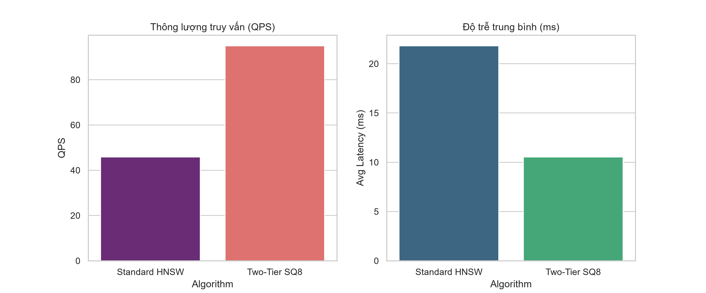

<div align="center">

# Two-Tier Quantized HNSW: Hệ thống tìm kiếm Vector tỷ lệ tỷ bản ghi

<p align="center">
  <a href="README.md"></a>&nbsp;
  <a href="README_VN.md"></a>
</p>

[](https://www.python.org/downloads/)
[](LICENSE)

[Tính năng](#-tính-năng-cốt-lõi) · [Cài đặt](#-cài-đặt) · [Khám phá](#-khám-phá) · [API](#%EF%B8%8F-api)

</div>

---

> 🤝 **Chúng tôi hoan nghênh mọi đóng góp!** Vui lòng tham khảo [Hướng dẫn đóng góp](CONTRIBUTING.md) để biết thêm chi tiết về tiêu chuẩn mã nguồn.

---

## ✨ Tính năng cốt lõi

Two-Tier Quantized HNSW là kiến trúc tìm kiếm Láng giềng gần nhất xấp xỉ (ANN) được tối ưu nhằm phá vỡ giới hạn bộ nhớ của thuật toán HNSW truyền thống trên các cơ sở dữ liệu vector quy mô lớn.

- **Lượng tử hóa SQ8 (SQ8 Quantization)** — Ép nén vector float32 384-chiều xuống số nguyên 8-bit, giảm ~75% dung lượng lưu trữ.
- **Kiến trúc hai tầng (Two-Tier Architecture)** — Tách rạch ròi quá trình định tuyến đồ thị cực nhanh (trên RAM) và quá trình đối chiếu khoảng cách chính xác (trên SSD).
- **Dừng sớm tự thích ứng (Adaptive Early-Exit)** — Tự động ngắt vòng lặp duyệt đồ thị khi phát hiện hội tụ, đẩy mạnh thông lượng QPS.
- **Direct I/O Storage** — Bỏ qua cơ chế ánh xạ bộ nhớ của hệ điều hành (`mmap`) để đọc vector ứng viên thẳng từ ổ cứng SSD, triệt tiêu hoàn toàn lỗi vỡ tiến trình (Out-Of-Memory).

---

## 🚀 Cài đặt

Dự án phân tách trạng thái runtime khỏi kho dữ liệu index. Dữ liệu vector được lưu ở `shards_db/`, trong khi cấu hình nằm tại `configs/`.

<details>
<summary><b>Lựa chọn 1 — Cài đặt từ Source Code</b> · Khuyên dùng</summary>

Yêu cầu **Python 3.11+** và **Node.js 20+** (để chạy Dashboard).

```bash
git clone https://github.com/USER/HNSW_NEW.git
cd HNSW_NEW

# Cài đặt Backend
python -m venv.venv
source.venv/bin/activate  # Trên Windows:.\.venv\Scripts\Activate.ps1
pip install -e.

# Khởi chạy Search Service
python dashboard/scripts/search_service.py
```

Mở một Terminal mới để chạy Frontend:

```bash
cd dashboard
npm install
node server.js
```

Truy cập [http://127.0.0.1:3000](http://127.0.0.1:3000) trên trình duyệt.

</details>

<details>
<summary><b>Cấu trúc hệ thống</b> — Cấu hình Pipeline tại <code>configs/</code></summary>

| File | Chức năng |
|:---|:---|
| `default_pipeline.json` | Khai báo số chiều vector, quy mô dataset đích (VD: 10M, 16.45M) |
| `tuning_pareto_results.json` | Kết quả dò tìm siêu tham số cho Early-Exit ($\tau, \epsilon$) |

</details>

---

## 📖 Khám phá

<details>
<summary><b>📊 Đo lường hiệu năng — Technical Deep Dive</b></summary>

<div align="center">

</div>

Kiến trúc duy trì đường cong độ trễ (latency) logarit rất thấp. Ở quy mô tải cực đại 16.45 triệu bản ghi, hệ thống trả kết quả chỉ trong **3.6 ms**. Thuật toán HNSW truyền thống sẽ văng lỗi (OOM) tại mốc này do cạn kiệt 25GB RAM, trong khi kiến trúc SQ8 Direct I/O của chúng tôi chỉ tiêu hao **65 MB**.

</details>

---

## ⌨ API

Backend được thiết kế chuẩn REST API để dễ dàng tích hợp vào hệ thống lớn.

<details>
<summary><b>Search Service API</b></summary>

```bash
# Gửi request truy vấn
curl -X POST http://localhost:5005/search \
  -H "Content-Type: application/json" \
  -d '{"query": "học máy", "top_k": 5, "ef_search": 40}'
```

Trả về dữ liệu JSON có cấu trúc gồm `distance`, `shard_id`, và `doc_id`.

</details>

---

## 🌐 Cộng đồng

### 🔗 Nhóm phát triển

Dự án được phát triển bởi Nhóm nghiên cứu HNSW.

### 🙏 Lời cảm ơn

Dự án được xây dựng dựa trên thuật toán HNSW nguyên bản và lấy cảm hứng thiết kế hệ thống từ các Vector Database hiện đại như Milvus và Qdrant.

<div align="center">
Được phân phối dưới giấy phép [MIT License](LICENSE).
</div>
