> **LƯU Ý:** Tài liệu này đã cũ và được thay thế toàn bộ bởi [BAO_CAO_LUAN_VAN_CHIT_TIET.md](BAO_CAO_LUAN_VAN_CHIT_TIET.md). Xin vui lòng tham khảo file báo cáo chính thức để xem kiến trúc Two-Tier HNSW lượng tử hóa SQ8 mới nhất.

# Báo cáo Kỹ thuật Chi tiết: Luồng Thu thập Dữ liệu (Crawler Pipeline)

Tài liệu này được biên soạn dành cho kỹ sư mới nhằm giải thích chi tiết cấu trúc, nguyên lý thiết kế, mã nguồn từng hàm và lý do lựa chọn các giải pháp kỹ thuật trong hệ thống thu thập dữ liệu toàn văn quy mô lớn.

---

## 1. Tổng quan Kiến trúc Hệ thống Thu thập

Hệ thống thu thập được thiết kế theo mô hình kiến trúc dạng ống dẫn (Pipeline Architecture) với các nguyên tắc cốt lõi:

1. **Bảo toàn 100% nội dung toàn văn:** Không cắt cụt thân bài, không chỉ lấy tiêu đề hay tóm tắt.
2. **Không tràn bộ nhớ RAM (Zero-OOM Streaming):** Sử dụng `Generator` (`yield`) và ghi luồng trực tiếp ra đĩa SSD. Không bao giờ gom hàng triệu bản ghi vào một mảng Python trong bộ nhớ.
3. **Phân đoạn Shard chuẩn hóa (Chunked Storage):** Dữ liệu được chia nhỏ thành các tệp `shard_XXXXX.jsonl` cố định 50.000 bản ghi/tệp, giúp việc đọc song song, nén và lập chỉ mục không bị nghẽn I/O.
4. **Khả năng tự phục hồi (Resumability & Checkpointing):** Khi tiến trình gặp sự cố mạng hoặc khởi động lại máy, hệ thống tự động nhận diện shard đã hoàn thành và tiếp tục công việc từ điểm dừng gần nhất.

```mermaid
flowchart TD
    subgraph Sources ["Nguồn Dữ liệu"]
        S1["Báo điện tử Việt Nam (VNExpress, Dân Trí, Tuổi Trẻ...)"]
        S2["Kho ngữ liệu văn bản Pháp luật"]
        
    end

    subgraph Network ["Tầng Mạng & Kết nối"]
        HC["HttpClient (src/crawler/http_client.py)<br/>• Exponential Backoff<br/>• Rate Limiting<br/>• User-Agent Rotation"]
    end

    subgraph Parsing ["Tầng Bóc tách & Chuẩn hóa"]
        AP["ArticleParser (src/crawler/extractors/article_parser.py)<br/>Trích xuất tiêu đề, tóm tắt, toàn văn thân bài"]
        CW["Wikitext Cleaner (scripts/run_wiki_crawler.py)<br/>Bóc tách cấu trúc section và paragraph"]
        TC["TextCleaner (src/crawler/extractors/text_cleaner.py)<br/>Chuẩn hóa Unicode NFC, xóa HTML, dọn khoảng trắng"]
    end

    subgraph Storage ["Tầng Lưu trữ Đĩa SSD"]
        SW["ShardWriter (src/crawler/storage/shard_writer.py)<br/>• Ghi luồng JSONL<br/>• Tự động quay vòng Shard (50.000 bản ghi)<br/>• Xuất CRAWL_MANIFEST.json"]
        D1[("data/crawl/<br/>200 shards, 10M bản ghi")]
        D2[("data/crawl_wiki/<br/>200 shards, 10M bản ghi")]
    end

    S1 --> HC --> AP --> TC --> SW --> D1
    S2 --> HC --> AP --> TC --> SW --> D1
    S3 --> CW --> TC --> SW --> D2
```



---

## 2. Giải thích Chi tiết Từng Module và Tệp Mã Nguồn

### 2.1. Cấu hình hệ thống: `src/crawler/config.py`

#### Mục đích và vai trò
Quản lý toàn bộ tham số môi trường tập trung, tránh tình trạng viết cứng (hardcode) các thông số mạng vào code xử lý logic.

#### Các thành phần mã nguồn chính
```python
@dataclass
class CrawlerConfig:
    user_agent: str = "Mozilla/5.0 (Windows NT 10.0; Win64; x64) AppleWebKit/537.36..."
    request_timeout: int = 15
    max_retries: int = 3
    retry_backoff_factor: float = 1.5
    rate_limit_delay: float = 0.5
    shard_size: int = 50000
    rss_feeds: Dict[str, List[str]] = field(default_factory=lambda: {...})
```

#### Giải thích lý do thiết kế và quy tắc đặt tên cho nhân viên mới
- **Tại sao dùng `@dataclass`?** Dataclass trong Python tự động tạo các hàm `__init__`, `__repr__`, giúp mã nguồn ngắn gọn, hỗ trợ type hinting chặt chẽ và dễ dàng serialize/deserialize khi cần.
- **Tại sao đặt tên `retry_backoff_factor`?** Trong lập trình mạng, khi máy chủ quá tải và trả về mã lỗi 429 hoặc 503, việc gửi lại yêu cầu ngay lập tức sẽ làm sập máy chủ. Hệ số giãn cách lùi lũy thừa (Exponential Backoff Factor) sẽ nhân thời gian chờ sau mỗi lần thử lại: $t = \text{backoff} \times 2^{\text{retry}}$, giúp giảm áp lực lên máy chủ nguồn.
- **Tại sao `rate_limit_delay = 0.5`?** Đây là nguyên tắc thu thập dữ liệu văn minh (Polite Crawling). Đảm bảo không gửi quá 2 yêu cầu/giây đến cùng một domain báo chí để không gây nghẽn dịch vụ của họ.

---

### 2.2. Giao tiếp mạng: `src/crawler/http_client.py`

#### Mục đích và vai trò
Bọc toàn bộ logic gọi mạng HTTP qua thư viện `requests`, xử lý tự động cơ chế kết nối lại, quản lý phiên làm việc (`requests.Session`) để tái sử dụng kết nối TCP/TLS Socket.

#### Các hàm chính trong `HttpClient`
1. `__init__(self, config: Optional[CrawlerConfig] = None)`
   - *Mục đích:* Khởi tạo session và thiết lập `urllib3.util.retry.Retry`.
   - *Lý do:* Tái sử dụng socket giúp giảm độ trễ từ 150ms xuống dưới 20ms cho mỗi lượt gọi, vì không phải bắt tay TLS (TLS Handshake) lại từ đầu.
2. `_enforce_rate_limit(self, domain: str)`
   - *Mục đích:* Đo khoảng thời gian giữa hai lượt gọi kế tiếp đến cùng một domain. Nếu nhỏ hơn `rate_limit_delay`, tiến trình sẽ `time.sleep` phần thời gian chênh lệch.
   - *Tên hàm:* Tiền tố `_` biểu thị hàm nội bộ (private method), tên `enforce_rate_limit` nói rõ hành vi bắt buộc tuân thủ hạn ngạch tốc độ.
3. `get(self, url: str) -> Optional[requests.Response]`
   - *Mục đích:* Thực hiện yêu cầu HTTP GET an toàn, tự động bắt tất cả các lỗi ngoại lệ `requests.RequestException` và trả về `None` thay vì làm sập toàn bộ luồng cào.

---

### 2.3. Bóc tách bài báo toàn văn: `src/crawler/extractors/article_parser.py`

#### Mục đích và vai trò
Chuyển đổi chuỗi HTML thô thành đối tượng bài viết có cấu trúc (`title`, `description`, `content_full`).

#### Logic bóc tách DOM
```python
def extract_full_article(self, html_content: str, url: str) -> Optional[Dict[str, str]]:
```
- **Bộ chọn CSS chuyên biệt (Domain-Specific Selectors):** Mỗi tòa soạn sử dụng các thẻ div chứa thân bài khác nhau:
  - VNExpress: `p.description`, `article.fck_detail p.Normal`
  - Dân Trí: `h1.title-page`, `div.singular-content p`
  - Tuổi Trẻ: `h1.article-title`, `div.content-fck p`
  - Thanh Niên: `h1.detail-title`, `div.detail-cmain p`
  - VietnamNet: `h1.content-detail-title`, `div.maincontent p`
- **Loại bỏ thẻ rác trước khi lấy text:**
  Hàm tự động quét và xóa các thành phần:
  ```python
  for junk in soup.find_all(["script", "style", "iframe", "table", "figure"]):
      junk.decompose()
  for junk_class in [".related-news", ".box-category", ".inner-article", ".z-quote"]:
      for el in soup.select(junk_class):
          el.decompose()
  ```
  *Lý do:* Các khối bài viết liên quan, quảng cáo chèn giữa bài thường chứa văn bản lạc đề, nếu không lọc sẽ làm hỏng vector đặc trưng ngữ nghĩa của bài viết.

---

### 2.4. Chuẩn hóa văn bản: `src/crawler/extractors/text_cleaner.py`

#### Mục đích và vai trò
Đảm bảo tính đồng nhất của văn bản tiếng Việt trước khi đưa vào bộ chia đoạn và nhúng vector.

#### Các hàm chính trong `TextCleaner`
1. `normalize_unicode(text: str) -> str`
   - *Mã nguồn:* `unicodedata.normalize("NFC", text)`
   - *Tại sao cực kỳ quan trọng đối với tiếng Việt?* Tiếng Việt có hai kiểu dựng mã Unicode:
     - **Tổ hợp (NFD):** Ký tự gốc và dấu thanh tách rời (ví dụ: `a` + dấu huyền = `à`, tốn 2 codepoints).
     - **Dựng sẵn (NFC):** Ký tự có dấu được mã hóa thành 1 codepoint duy nhất.
     Nếu không đưa về NFC, hai từ cùng hiển thị giống nhau trên màn hình sẽ sinh ra hai vector đặc trưng hoàn toàn lệch nhau trong không gian vector.
2. `strip_html(text: str) -> str`
   - Sử dụng regex `re.sub(r"<[^>]+>", " ", text)` để dọn dẹp các thẻ tag sót lại từ quá trình bóc tách.
3. `remove_urls(text: str) -> str`
   - Loại bỏ các đường dẫn `http://` hoặc `https://` nằm rải rác trong thân bài để tránh sinh nhiễu ngữ nghĩa.
4. `clean(text: str) -> str`
   - Hàm tổng hợp chạy toàn bộ chuỗi làm sạch và nén khoảng trắng thừa (`\s+` $\to$ `" "`).

---

### 2.5. Phân mảnh lưu trữ Shard: `src/crawler/storage/shard_writer.py`

#### Mục đích và vai trò
Nhận từng bản ghi dữ liệu đã làm sạch và ghi tuần tự vào các tệp JSONL theo kích thước cố định (50.000 dòng/shard), đồng thời tự động cập nhật tệp kê khai `CRAWL_MANIFEST.json`.

#### Cơ chế hoạt động của `ShardWriter`
- **Tại sao chọn định dạng JSONL (JSON Lines)?**
  - Khác với JSON thông thường (bắt buộc phải có cặp ngoặc `[...]` bao toàn bộ file), định dạng JSONL lưu mỗi bản ghi trên đúng 1 dòng văn bản phân tách bằng dấu xuống dòng `\n`.
  - *Lợi ích 1:* Cho phép mở file ở chế độ nối tiếp `append ("a")` và ghi ngay lập tức vào đĩa mà không cần nạp cả file cũ vào RAM.
  - *Lợi ích 2:* Nếu tiến trình bị mất điện hoặc crash đột ngột, toàn bộ các dòng đã ghi trước đó vẫn nguyên vẹn 100%, không bị hỏng cấu trúc cú pháp JSON của toàn bộ file.
  - *Lợi ích 3:* Cho phép các công cụ dòng lệnh Unix/Windows (`head`, `tail`, `wc -l`) và Python `line by line stream` đọc dữ liệu với độ phức tạp bộ nhớ $O(1)$.
- **Hàm `write(self, record: Dict[str, Any])`:**
  - Kiểm tra nếu `_current_file` chưa mở, tự động gọi `_get_shard_path(idx)` để mở file `shard_XXXXX.jsonl`.
  - Khi `current_shard_count >= shard_size` (50.000), file hiện tại được gọi `.flush()` và `.close()`, sau đó tăng `current_shard_idx` để chuyển sang shard mới.
- **Hàm `close(self)`:**
  - Đóng tệp đang mở và quét toàn bộ thư mục để tính tổng số tài liệu, tổng dung lượng MB/GB và ghi ra `CRAWL_MANIFEST.json`.

---

#### Mục đích và vai trò

#### Các hàm chuyên biệt trong `run_wiki_crawler.py`
1. `clean_wikitext(text: str) -> str`
   - Sử dụng các biểu thức chính quy (Regex) tối ưu để loại bỏ toàn bộ cú pháp đánh dấu Wikitext:
     - Xóa template hộp thông tin: `re.sub(r"\{\{[^}]*\}\}", " ", text)`
     - Giữ lại nhãn liên kết nội bộ: `[[Hà Nội|thủ đô]]` $\to$ `thủ đô`
     - Xóa thẻ tham chiếu nguồn học thuật: `<ref>...</ref>`
     - Xóa bảng biểu wiki: `\{\|.*?\|\}`
2. `is_boilerplate_header(header_name: str) -> bool`
   - Kiểm tra các tiêu đề mục phụ lục như *"Tham khảo"*, *"Liên kết ngoài"*, *"Xem thêm"*, *"Tài liệu tham khảo"*.
   - *Lý do:* Các mục này chỉ chứa đường link, tên sách hoặc số ISBN, không chứa tri thức thực sự, việc loại bỏ giúp nâng cao độ chính xác của ngữ liệu.

   - Sử dụng `datasets.load_dataset(..., streaming=True)` để kết nối trực tiếp đến các tệp lưu trữ Parquet trên Hugging Face.
   - Trích xuất từng bài viết và phân tách thành các mục ngữ cảnh độc lập theo định dạng header `== ... ==`.
   - Mỗi mục có độ dài $\ge 15$ từ được sinh ra (`yield`) thành một bản ghi hoàn chỉnh:
     ```json
     {
       "doc_id": "wiki_291b11bddbdb8fe4",
       "title": "Internet Society - Mục tiêu hoạt động",
       
       "content_full": "Nội dung văn bản toàn văn của mục...",
       
     }
     ```
4. `main()`
   - Quản lý vòng lặp thu thập tới mốc 10.000.000 bản ghi.
   - Ghi checkpoint định kỳ mỗi 10.000 bản ghi vào `data/crawl_wiki/crawl_checkpoint.json`.
   - Tự động duy trì bộ nhớ đệm băm `seen_hashes` để loại trừ trùng lặp nội dung khi chuyển giữa các nguồn dữ liệu.

---

## 3. Tổng kết Cấu trúc Thư mục và Tập Dữ liệu Cào

```text
ANN/
├── data/
│   ├── crawl/                                # Dữ liệu Báo chí & Pháp luật (16.459.486 bản ghi)
│   │   ├── CRAWL_MANIFEST.json               # Kê khai 200 shards, 20.45 GB
│   │   ├── shard_00000.jsonl                 # Phân đoạn bản ghi toàn văn
│   │   └── ... (shard_00001 -> shard_00199)
│   │
│       ├── crawl_checkpoint.json             # Lưu vết tiến độ thu thập
│       ├── shard_00000.jsonl                 # Phân đoạn bách khoa toàn thư
│       └── ... (shard_00001 -> shard_00199)
│
├── src/crawler/                              # Thư viện crawler dùng chung
│   ├── config.py                             # Cấu hình tham số mạng
│   ├── http_client.py                        # Client HTTP có backoff retry
│   ├── extractors/
│   │   ├── article_parser.py                 # Bóc tách DOM HTML
│   │   └── text_cleaner.py                   # Chuẩn hóa Unicode NFC
│   ├── sources/
│   │   ├── rss_crawler.py                    # Cào RSS báo chí
│   │   ├── hf_streamer.py                    # Truyền phát dữ liệu mở
│   │   └── drive_downloader.py               # Tải tệp lớn từ đám mây
│   ├── storage/
│   │   └── shard_writer.py                   # Bộ phân đoạn ghi đĩa JSONL
│   └── pipeline.py                           # Điều phối cào Báo chí
│
└── scripts/
    ├── run_crawler.py                        # CLI cào tin tức & pháp luật
```

