> **LƯU Ý:** Tài liệu này đã cũ và được thay thế toàn bộ bởi [BAO_CAO_LUAN_VAN_CHIT_TIET.md](BAO_CAO_LUAN_VAN_CHIT_TIET.md). Xin vui lòng tham khảo file báo cáo chính thức để xem kiến trúc Two-Tier HNSW lượng tử hóa SQ8 mới nhất.

# Báo cáo Kỹ thuật Chi tiết: Luồng Xử lý Dữ liệu và Lượng tử hóa Vector (Quantization Pipeline)

Tài liệu này được biên soạn dành cho kỹ sư mới nhằm giải thích bản chất toán học, kiến trúc phần mềm, nguyên lý tối ưu hóa phần cứng GPU và chi tiết từng hàm trong luồng xử lý và lượng tử hóa vector quy mô lớn.

---

## 1. Tổng quan Kiến trúc Luồng Lượng tử hóa

Trong các hệ thống tìm kiếm ngữ nghĩa quy mô hàng chục triệu bản ghi, việc lưu trữ vector dạng dấu phẩy động 32-bit (`float32`) trực tiếp trên RAM là không khả thi:
- 10 triệu vector 384 chiều kiểu `float32` tiêu tốn:
  $$10.000.000 \times 384 \times 4 \text{ bytes} = 15.360.000.000 \text{ bytes} \approx 15,36 \text{ GB RAM}$$
- Khi mở rộng lên 16,5 triệu vector (sau khi phân tách chunk), dung lượng RAM yêu cầu vượt quá **24,11 GB**, gây tràn bộ nhớ trên hầu hết các máy chủ tiêu chuẩn.

**Giải pháp Lượng tử hóa Vô hướng 8-bit (Scalar Quantization - SQ8):**
Nén mỗi chiều không gian từ 4 bytes (`float32`) xuống đúng 1 byte (`int8`), giảm **75% dung lượng bộ nhớ**, đưa toàn bộ kho 16,5 triệu vector về mức **6,32 GB**, có thể ánh xạ bộ nhớ (`numpy.memmap`) và tìm kiếm thời gian thực với độ suy hao ngữ nghĩa (Cosine Similarity Loss) dưới $0,5\%$.

```mermaid
flowchart TD
    subgraph Input ["Đầu vào Shard Toàn văn"]
        S["Các tệp Shard JSONL<br/>(data/crawl/ hoặc data/crawl_wiki/)"]
    end

    subgraph Step1 ["Bước 1: Phân đoạn Ngữ cảnh"]
        TC["TextChunker (src/quantizer/chunker.py)<br/>• Window: 300 từ<br/>• Overlap: 50 từ gối đầu<br/>• Giữ nguyên cấu trúc văn bản"]
    end

    subgraph Step2 ["Bước 2: Nhúng Ngữ nghĩa GPU"]
        EM["SentenceTransformerEmbedder (src/ann_data/embedder.py)<br/>• Model: paraphrase-multilingual-MiniLM-L12-v2<br/>• NVIDIA RTX 4060 GPU (CUDA)<br/>• Batch size: 512 (~2.670 vecs/s)"]
    end

    subgraph Step3 ["Bước 3: Lượng tử hóa Vô hướng"]
        SQ["ScalarQuantizer8 (src/quantizer/sq8.py)<br/>• Fit min/max per dimension<br/>• Linear projection: float32 -> int8 [-128, 127]<br/>• Giảm 75% RAM"]
    end

    subgraph Step4 ["Bước 4: Lưu trữ Memmap & Siêu dữ liệu"]
        QS["QuantizedStorage (src/quantizer/storage.py)<br/>• vectors_int8.dat (nhị phân memmap)<br/>• metadata.jsonl (tra cứu toàn văn)<br/>• quantization_params.json<br/>• Checkpoint & Manifest"]
    end

    subgraph SearchEngine ["Bước 5: Tìm kiếm Ngữ nghĩa Thời gian thực"]
        SE["SemanticSearchEngine (src/ann_data/search/semantic_engine.py)<br/>• Scaled dot-product trên vector int8<br/>• Quét 16+ triệu vector trong < 1.5 giây<br/>• Single-pass metadata retrieval"]
    end

    S --> TC --> EM --> SQ --> QS --> SearchEngine
```



---

## 2. Nền tảng Toán học của Thuật toán Scalar Quantization (SQ8)

### 2.1. Công thức nén (Quantization)
Cho mảng vector đặc trưng đầu vào $X \in \mathbb{R}^{N \times D}$ ($D = 384$). Với mỗi chiều không gian $d \in [0, D-1]$:
1. Tìm giá trị nhỏ nhất và lớn nhất trên tập huấn luyện mẫu:
   $$\min_d = \min_{i} X_{i, d}, \quad \max_d = \max_{i} X_{i, d}$$
2. Xác định hệ số co giãn (Scaling factor) phân bố đều trên 255 mức:
   $$\text{scale}_d = \frac{\max_d - \min_d}{255.0}$$
3. Chuyển đổi giá trị liên tục $x \in [\min_d, \max_d]$ sang số nguyên có dấu 8-bit $q \in [-128, 127]$:
   $$\text{norm}_d = \text{clip}\left(\frac{x - \min_d}{\text{scale}_d}, 0, 255\right)$$
   $$q = \text{round}(\text{norm}_d) - 128$$

### 2.2. Công thức khôi phục (Dequantization)
Khi cần tái tạo lại vector xấp xỉ $\hat{x} \in \mathbb{R}$ từ số nguyên $q \in [-128, 127]$:
$$\hat{x} = (q + 128) \times \text{scale}_d + \min_d$$

### 2.3. Tối ưu hóa tính tích vô hướng (Inner Product Acceleration)
Khi thực hiện truy vấn với vector câu hỏi $Q \in \mathbb{R}^D$ và vector tài liệu đã lượng tử hóa $V_{\text{int8}} \in \mathbb{Z}^D$:
$$\langle Q, \hat{V} \rangle = \sum_{d=0}^{D-1} Q_d \cdot \left[(V_{\text{int8}, d} + 128) \cdot \text{scale}_d + \min_d\right]$$
Biến đổi đại số:
$$\langle Q, \hat{V} \rangle = \sum_{d=0}^{D-1} \underbrace{(Q_d \cdot \text{scale}_d)}_{Q'_d} \cdot V_{\text{int8}, d} + \underbrace{\sum_{d=0}^{D-1} Q_d \cdot (128 \cdot \text{scale}_d + \min_d)}_{\text{Hằng số } C_Q \text{ tính 1 lần duy nhất}}$$
Nhờ biến đổi này, câu truy vấn chỉ cần nhân trước với $\text{scale}_d$ để tạo ra $Q'$, sau đó phép tính khoảng cách trên hàng triệu vector trở thành **phép nhân ma trận số nguyên siêu tốc (BLAS dot product)**, loại bỏ hoàn toàn chi phí giải nén từng vector.

---

## 3. Phân tích Chi tiết Từng Module Mã Nguồn

### 3.1. Phân đoạn văn bản: `src/quantizer/chunker.py`

#### Mục đích và vai trò
Các mô hình Transformer như MiniLM có giới hạn cửa sổ ngữ cảnh (Context Length) tối đa 256 - 512 tokens. Nếu đưa cả bài báo dài 3.000 từ vào, mô hình sẽ tự động cắt bỏ phần đuôi bài viết. `TextChunker` đảm bảo mọi phân đoạn của bài viết đều được lập chỉ mục đầy đủ.

#### Các thành phần chính trong `TextChunker`
```python
class TextChunker:
    def __init__(self, chunk_size: int = 300, chunk_overlap: int = 50):
        self.chunk_size = chunk_size
        self.chunk_overlap = chunk_overlap
```
- **Hàm `chunk_document(self, doc_id, title, full_text)`:**
  - Tách văn bản thành danh sách từ: `words = full_text.split()`.
  - Nếu `total_words <= chunk_size` (300 từ): Trả về 1 chunk duy nhất với chỉ số `_c0`.
  - Nếu bài viết dài: Dùng cửa sổ trượt với bước nhảy $\text{step} = \text{chunk\_size} - \text{chunk\_overlap} = 300 - 50 = 250$ từ.
  - *Tại sao cần vùng gối đầu (overlap 50 từ)?* Nếu một câu văn quan trọng nằm đúng ranh giới cắt giữa từ thứ 295 và 305, việc gối đầu 50 từ sẽ giữ trọn vẹn ngữ nghĩa của câu ở cả hai đoạn kế tiếp nhau, tránh hiện tượng đứt gãy ngữ cảnh khi người dùng tìm kiếm.
  - *Xử lý đoạn đuôi (Tail Pruning):* Nếu đoạn cuối cùng có ít hơn 75 từ (`chunk_size // 4`), hàm sẽ bỏ qua hoặc gộp để tránh tạo ra các chunk phân mảnh rác.

---

### 3.2. Bộ nén lượng tử hóa vô hướng: `src/quantizer/sq8.py`

#### Mục đích và vai trò
Cài đặt thuật toán nén SQ8 từ `float32` sang `int8`, đo lường sai số phục hồi và xuất/nhập tham số nén.

#### Các hàm chính trong `ScalarQuantizer8`
1. `fit(self, vectors: np.ndarray) -> "ScalarQuantizer8"`
   - Nhận mảng mẫu vector `float32` kích thước $(N, D)$.
   - Tính `min_vals = np.min(vectors, axis=0)` và `max_vals = np.max(vectors, axis=0)`.
   - Tính mảng tỉ lệ `scales = (max_vals - min_vals) / 255.0`. Nếu hiệu số quá nhỏ ($< 10^{-8}$), gán bằng $1.0$ để chống lỗi chia cho 0.
2. `quantize(self, vectors: np.ndarray) -> np.ndarray`
   - Nén mảng $(N, D)$ sang kiểu `np.int8`.
   - Sử dụng `np.clip` và `np.round` để chuyển đổi tuyến tính.
3. `dequantize(self, quantized_vectors: np.ndarray) -> np.ndarray`
   - Khôi phục vector sang `np.float32`.
4. `compute_reconstruction_error(self, original_vectors: np.ndarray) -> Dict[str, float]`
   - Đo sai số bình phương trung bình (MSE Loss) và độ tương đồng Cosine trung bình giữa vector gốc và vector sau khi nén-giải nén.
   - *Kết quả thực nghiệm:* MSE Loss $< 0,0002$, độ tương đồng Cosine $> 0,9998$ (độ chính xác bảo toàn gần như tuyệt đối).
5. `export_params()` và `load_params(params_dict)`
   - Chuyển đổi các mảng NumPy `min_vals`, `max_vals`, `scales` thành danh sách chuẩn Python để lưu vào `quantization_params.json` và tái nạp lại tức thì khi cần.

---

### 3.3. Quản lý lưu trữ Memmap đĩa: `src/quantizer/storage.py`

#### Mục đích và vai trò
Cung cấp cơ chế I/O tối ưu trên đĩa SSD, cho phép ứng dụng đọc/ghi hàng chục triệu vector mà dung lượng RAM sử dụng chỉ tốn vài megabytes.

#### Các kỹ thuật lập trình hệ thống được áp dụng
1. **Ánh xạ bộ nhớ nhị phân (`np.memmap`):**
   - Thay vì nạp toàn bộ tệp 6,32 GB vào RAM, `np.memmap` liên kết trực tiếp địa chỉ bộ nhớ ảo của tiến trình với các khối trang (Page Blocks) trên ổ cứng SSD thông qua nhân hệ điều hành (OS Virtual Memory Manager).
   - Chỉ những trang dữ liệu nào được CPU đọc tới mới được nạp vào cache, giúp tiến trình khởi động ngay trong $0,001$ giây dù dữ liệu lớn hàng chục gigabytes.
2. **Cơ chế tiền cấp phát và co giãn động (`_resize_mmap`):**
   - Hàm `initialize_storage` tạo tệp trắng và gọi `f.truncate(capacity * dim * 1)` để cấp phát trước không gian liên tục trên bảng phân bổ tệp NTFS, tránh hiện tượng phân mảnh đĩa.
   - Nếu số lượng vector vượt quá sức chứa ban đầu, `_resize_mmap` sẽ tự động nhân đôi kích thước đệm (`capacity * 2`) và ánh xạ lại con trỏ.
3. **Chống nghẽn I/O (Disk Thrashing Mitigation):**
   - Nếu mỗi mẻ 512 vector đều gọi `mmap.flush()` và `meta_f.flush()`, ổ cứng SSD sẽ liên tục bị khóa đồng bộ (Synchronous Write Blocking), kéo tụt tốc độ từ $2.500$ vecs/s xuống còn $150$ vecs/s.
   - Hàm `append_batch` nhận cờ `flush=False`. Toàn bộ dữ liệu được gom vào bộ đệm của hệ điều hành và chỉ xả triệt để một lần duy nhất khi kết thúc mỗi shard thông qua hàm `flush_buffers()`.
4. **Cắt tỉa tệp chính xác (Exact File Truncation):**
   - Khi kết thúc quá trình lượng tử hóa (`storage.close()`), hàm tự động cắt bỏ phần dung lượng đệm dư thừa bằng lệnh `f.truncate(self.current_count * self.dim * 1)`, đảm bảo kích thước tệp trên đĩa khớp chính xác từng byte theo số lượng vector thực tế.

---

### 3.4. Mô hình nhúng ngôn ngữ tăng tốc GPU: `src/ann_data/embedder.py`

#### Mục đích và vai trò
Chuyển hóa văn bản tiếng Việt thành dense vector 384 chiều bằng mô hình Transformer sâu `paraphrase-multilingual-MiniLM-L12-v2`.

#### Tối ưu hóa trên phần cứng NVIDIA GeForce RTX 4060
1. **Tự động nhận diện phần cứng (Auto Device Selection):**
   ```python
   device = "cuda" if torch.cuda.is_available() else "cpu"
   self._model = SentenceTransformer(self.model_name, device=device)
   ```
   Tận dụng nhân Tensor Core trên card đồ họa rời RTX 4060, giúp tăng tốc độ tính toán ma trận lên gấp **$15 - 20$ lần** so với chạy trên CPU.
2. **Kích thước lô tính toán lớn (`batch_size=512`):**
   - Với bộ nhớ VRAM 8 GB của card RTX 4060, kích thước lô 512 mẫu văn bản tận dụng tối đa băng thông bộ nhớ GPU mà chỉ tiêu tốn khoảng 2,1 GB VRAM.
   - Tốc độ xử lý thực nghiệm đạt **$2.673$ văn bản/giây** (so với 1.450 vecs/s ở batch 256 và 650 vecs/s ở batch 64).
3. **Cơ chế an toàn (Fallback Mock Embedder):**
   - Nếu môi trường máy chủ chạy kiểm thử thiếu thư viện PyTorch hoặc không có kết nối mạng tải model, class tự động kích hoạt `MockEmbedder` để toàn bộ bài test logic I/O vẫn chạy bình thường mà không bị crash.

---

### 3.5. Bộ điều phối lượng tử hóa: `src/quantizer/pipeline.py`

#### Mục đích và vai trò
Kết nối tất cả các module đơn lẻ thành một chu trình khép kín: đọc shard thô $\to$ chia đoạn $\to$ nhúng GPU $\to$ nén SQ8 $\to$ ghi đĩa SSD $\to$ lưu checkpoint.

#### Cơ chế tự phục hồi lỗi (Resumable Checkpointing)
```python
def process(self, limit: Optional[int] = None, resume: bool = True) -> Dict[str, Any]:
```
- Khi bắt đầu, pipeline kiểm tra tệp `data/quantized/checkpoint.json`:
  ```json
  {
    "completed_shards": ["shard_00000.jsonl", "shard_00001.jsonl", ...],
    "total_vectors": 15096676,
    "last_shard": "shard_00174.jsonl",
    "last_updated": "2026-09-05T17:46:24Z"
  }
  ```
- Nếu `resume=True`, pipeline sẽ nạp lại tham số `quantization_params.json` đã fit từ trước (không cần trích mẫu lại) và lọc danh sách `shards_to_process` để **bỏ qua toàn bộ các shard đã hoàn thành**, mở file ở chế độ nối tiếp `mode="a"`.
- Nhờ cơ chế này, một tác vụ xử lý 10 triệu bản ghi kéo dài vài giờ có thể dừng bất kỳ lúc nào và chạy tiếp mà không mất mát dữ liệu.

---

### 3.6. Tìm kiếm ngữ nghĩa thời gian thực: `src/ann_data/search/semantic_engine.py`

#### Mục đích và vai trò
Cho phép truy vấn ngữ nghĩa tự nhiên trên tập 16,5 triệu vector int8 mà không gây tràn bộ nhớ RAM của máy tính.

#### Kỹ thuật giải quyết bài toán quy mô lớn
1. **Truy xuất siêu dữ liệu theo luồng (On-Demand Single-Pass Streaming):**
   - Tệp `metadata.jsonl` có dung lượng lên tới 22,3 GB. Nếu đọc toàn bộ vào một `list` trong Python, RAM sẽ bị tràn ngay lập tức.
   - `SemanticSearchEngine` chỉ tải siêu dữ liệu khi tệp $< 50$ MB. Với tệp lớn, sau khi tìm ra `top_k` chỉ số vector (ví dụ 5 chỉ số), hàm `get_metadata_for_indices` chỉ quét tuyến tính 1 lượt duy nhất qua tệp để trích xuất đúng 5 dòng tương ứng và dừng lại, tiêu tốn chưa tới 1 MB RAM.
2. **Tìm kiếm phân khối (Chunked Scanning on Memmap):**
   - Thay vì nhân toàn bộ ma trận 16,5 triệu vector cùng lúc, thuật toán chia mảng memmap thành từng khối 500.000 vector:
     ```python
     for start in range(0, self.num_records, chunk_size):
         chunk = self.raw_mmap[start:end].astype(np.float32)
         scores = np.dot(chunk, q_scaled)
         part = np.argpartition(scores, -k)[-k:]
     ```
   - Sử dụng `np.argpartition` thay vì `np.sort` đầy đủ giúp giảm độ phức tạp thuật toán từ $O(N \log N)$ xuống $O(N)$, hoàn thành quét toàn bộ 16,5 triệu vector trong thời gian dưới 1,5 giây.

---

## 4. Bảng So sánh Chỉ số Hiệu năng Thực tế

| Tiêu chí đo kiểm | Dạng gốc (Float32) | Lượng tử hóa SQ8 (Int8) | Mức cải thiện |
| :--- | :--- | :--- | :--- |
| **Dung lượng 1 vector (384 chiều)** | 1.536 bytes | 384 bytes | **Giảm 75,0%** |
| **Dung lượng 16.459.486 vector** | 24.110,58 MB (~24,11 GB) | 6.027,64 MB (~6,03 GB) | **Tiết kiệm 18,08 GB đĩa** |
| **Yêu cầu RAM để tải chỉ mục** | $> 25$ GB RAM | $\approx 20$ MB (nhờ Memmap) | **Không phụ thuộc RAM vật lý** |
| **Tốc độ mã hóa trên RTX 4060** | ~1.400 vecs/s (batch 256) | **2.673 vecs/s (batch 512)** | **Tăng tốc 91%** |
| **Thời gian quét tìm kiếm Top-5** | ~4,8 giây | **~1,45 giây** | **Nhanh hơn 3,3 lần** |
| **Độ tương đồng ngữ nghĩa (Cosine)** | 1,0000 | 0,9998 | **Độ suy hao $< 0,02\%$** |

---

## 5. Quy ước Đặt tên và Hướng dẫn cho Nhân viên Mới

1. **Quy tắc đặt tên file và module:**
   - Tất cả tên file mã nguồn dùng chữ thường phân cách bằng dấu gạch dưới (`snake_case`): `chunker.py`, `storage.py`, `run_quantization.py`.
   - Các class dùng quy tắc viết hoa chữ cái đầu (`PascalCase`): `ScalarQuantizer8`, `TextChunker`, `QuantizedStorage`.
2. **Quy tắc tiền tố và hậu tố biến:**
   - Biến kết thúc bằng `_mmap`: Đối tượng mảng ánh xạ bộ nhớ (`raw_mmap`).
   - Biến kết thúc bằng `_int8` hoặc `_float`: Thể hiện rõ kiểu dữ liệu số học để tránh nhầm lẫn khi truyền vào hàm nhân ma trận (`int8_vecs`, `float_vecs`).
   - Tiền tố `is_`: Biến kiểu boolean kiểm tra trạng thái (`is_fitted`, `is_int8`).
3. **Quy tắc bất biến khi mở rộng:**
   - Không được phép sửa mã nguồn của kịch bản crawl hay quantize cũ khi có yêu cầu nguồn dữ liệu mới; luôn tạo file độc lập kế thừa thư viện lõi để phục vụ việc đối soát và báo cáo độc lập.

