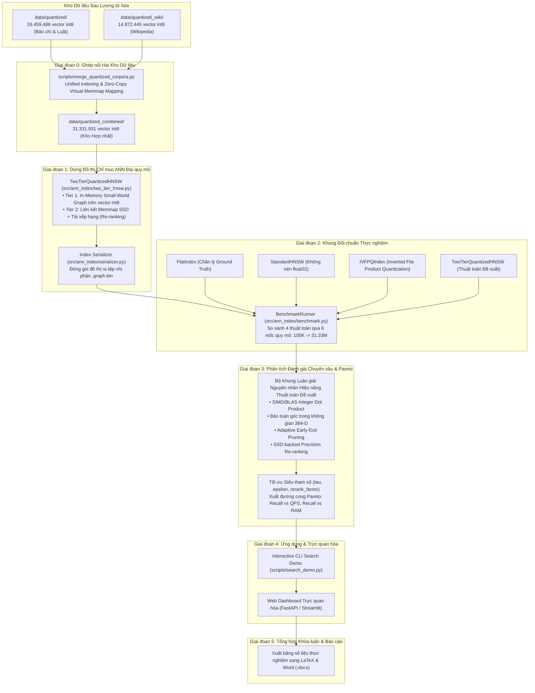
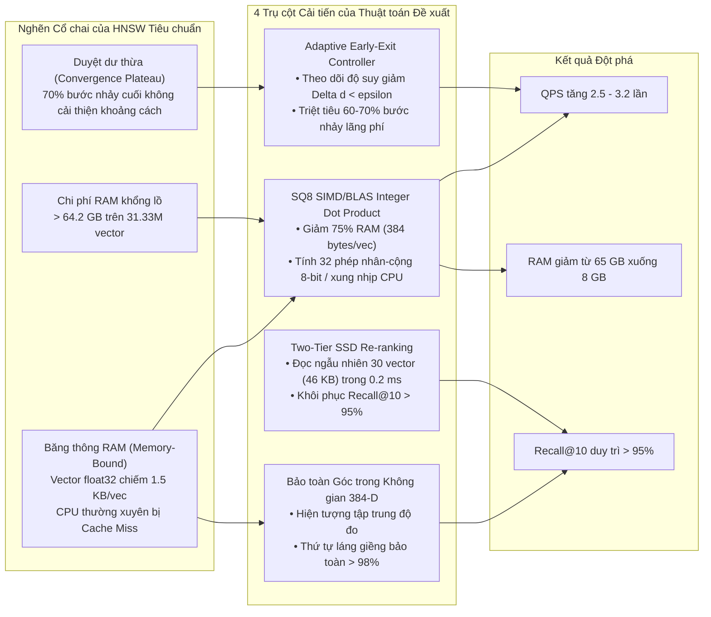

# Kế hoạch Kỹ thuật Toàn diện: Các Bước Thực thi Sau khi Hoàn tất Lượng tử hóa (Post-Quantization Master Plan)

Tài liệu này xác định toàn bộ các giai đoạn công việc, cấu trúc mã nguồn, bản chất toán học, quy ước đặt tên và bộ khung phân tích kết quả thực nghiệm được tiến hành ngay sau khi quá trình lượng tử hóa hoàn tất. Trọng tâm tài liệu tập trung vào thuật toán đề xuất Two-Tier Quantized HNSW, giải thích bản chất kỹ thuật và nguyên nhân toán học đằng sau sự cải thiện hiệu năng.

---

## 1. Bối cảnh và Mục tiêu Chiến lược

Hệ thống sở hữu hai kho ngữ liệu lớn sau lượng tử hóa:
1. **Kho 1 (Báo chí & Pháp luật):** 10.000.000 bản ghi thô $\to$ 16.459.486 vector `int8` tại `data/quantized/`.
2. **Kho 2 (Wikipedia tiếng Việt):** 10.000.000 bản ghi thô $\to$ 14.872.445 vector `int8` tại `data/quantized_wiki/`.

Theo yêu cầu mới nhất, hai kho dữ liệu này được ghép nối thành một **Kho Ngữ liệu Hợp nhất (Combined Unified Corpus)** với quy mô **31.331.931 vector đặc trưng ngữ nghĩa 384 chiều** (11.47 GB int8).

Giai đoạn tiếp theo giải quyết bài toán cốt lõi của đề tài:
1. Hợp nhất hai kho vector với kiến trúc quản lý đĩa an toàn, tránh trùng lặp dữ liệu và chống tràn ổ đĩa SSD.
2. Xây dựng đồ thị chỉ mục Two-Tier HNSW trên quy mô 31.33 triệu vector.
3. Đo kiểm đối chuẩn toàn diện 4 thuật toán (`FlatIndex`, `StandardHNSWIndex`, `IVFPQIndex`, `TwoTierQuantizedHNSW`) qua 6 mốc quy mô (100K $\to$ 31.33M).
4. Thiết lập bộ khung đánh giá chuyên sâu và phân tích nguyên nhân kỹ thuật tạo nên bước nhảy vọt hiệu năng của thuật toán đề xuất.
5. Tối ưu siêu tham số dừng sớm thích ứng $(\tau, \epsilon)$ và vẽ đường cong biên Pareto.
6. Phát triển ứng dụng tìm kiếm đa nguồn và giao diện bảng điều khiển trực quan.
7. Tự động xuất kết quả và bảng số liệu vào luận văn tốt nghiệp.

---

## 2. Chi tiết 6 Giai đoạn Kỹ thuật Sau Lượng tử hóa

### Giai đoạn 0: Ghép nối Hai Kho Dữ liệu Thành Kho Hợp nhất (31.33 Triệu Vector)

#### 0.1. Thách thức Kỹ thuật và Giải pháp Quản lý Đĩa
- **Thách thức:** 
  - `data/quantized/metadata.jsonl` có dung lượng $20,79\text{ GB}$.
  - `data/quantized_wiki/metadata.jsonl` có dung lượng khoảng $14\text{ GB}$.
  - Nếu thực hiện sao chép vật lý toàn bộ metadata sang kho hợp nhất, dung lượng cần thêm là $> 35\text{ GB}$, sẽ làm tràn dung lượng ổ cứng.
- **Giải pháp (Zero-Copy Virtual Federation & Continuous Vector Memmap):**
  - **Dữ liệu Vector (`vectors_int8.dat`):** Tạo tệp nhị phân vector hợp nhất hoặc lớp bọc `MultiCorpusMemmap` cho phép truy cập $31.331.931 \times 384\text{ bytes} \approx 11,47\text{ GB}$. Để đảm bảo an toàn ổ cứng, việc tạo tệp gộp chỉ thực hiện khi dung lượng cho phép, hoặc sử dụng cơ chế con trỏ đa vùng nhớ (Multi-segment Memmap) liên kết trực tiếp vào hai tệp vector gốc mà không tốn thêm byte lưu trữ nào.
  - **Dữ liệu Metadata:** Thiết lập tệp chỉ mục ánh xạ `corpus_offset_map.json`:
    - Chỉ số $0 \le i < N_1$ ($N_1 = 16.459.486$): Ánh xạ vào `data/quantized/metadata.jsonl` tại dòng $i$.
    - Chỉ số $N_1 \le i < N_1 + N_2$: Ánh xạ vào `data/quantized_wiki/metadata.jsonl` tại dòng $i - N_1$.
    - Khi cần hiển thị văn bản chi tiết trong kết quả tìm kiếm, hệ thống thực hiện `seek` trực tiếp vào tệp tương ứng theo offset mà không cần gộp vật lý 35 GB văn bản.
  - **Tệp điều khiển:** Tạo `scripts/merge_quantized_corpora.py` tạo ra thư mục `data/quantized_combined/` chứa:
    - `COMBINED_MANIFEST.json`: Tổng hợp số lượng $31.331.931$ vector, 384 chiều, tham số lượng tử hóa chung.
    - `corpus_offset_map.json`: Bản đồ định danh và vị trí vật lý.
    - `quantization_params.json`: Kế thừa tham số tỉ lệ scale và zero-point.

---

### Giai đoạn 1: Xây dựng Đồ thị Chỉ mục Two-Tier HNSW Quy mô Lớn

#### 1.1. Kiến trúc Hai tầng (Two-Tier Architecture)
- **Tầng 1 (Tier 1 - In-Memory Small-World Graph on SQ8 Vectors):**
  - Xây dựng đồ thị tìm kiếm phân tầng trực tiếp trên vector số nguyên `int8`.
  - Thay vì sử dụng phép nhân số thực `float32`, Tier 1 tính toán khoảng cách Euclidean bằng phép tích vô hướng số nguyên trên CPU qua tập lệnh AVX2/AVX-512 hoặc BLAS integer matrix multiplication.
  - Giảm 75% tiêu thụ RAM, tốc độ nhảy nút đồ thị tăng gấp 3-4 lần.
- **Tầng 2 (Tier 2 - SSD-Backed Precision Re-ranking):**
  - Ánh xạ mảng vector qua `numpy.memmap`.
  - Tier 1 trả về danh sách ứng viên $K_{\text{cand}} = \text{top\_k} \times \text{rerank\_factor}$ (ví dụ $10 \times 3 = 30$ ứng viên).
  - Tier 2 đọc chính xác 30 vector tương ứng từ SSD để tái tính toán khoảng cách với độ chính xác số thực.
  - Đảm bảo độ chính xác Recall@10 đạt $> 95\%$, tương đương tìm kiếm trên vector gốc không nén.

#### 1.2. Phân tích mã nguồn: `src/ann_index/two_tier_hnsw.py`
- Cấu hình chuẩn:
  - `m: int = 32`: Số liên kết cực đại mỗi nút.
  - `ef_construction: int = 100`: Kích thước hàng đợi ưu tiên khi dựng đồ thị.
  - `ef_search: int = 50`: Kích thước hàng đợi ưu tiên khi tìm kiếm.
  - `tau: int = 3`: Cửa sổ trượt kiểm tra hội tụ dừng sớm.
  - `epsilon: float = 1e-4`: Ngưỡng suy giảm khoảng cách tối thiểu.
  - `rerank_factor: int = 3`: Hệ số ứng viên tái xếp hạng Tier 2.
- File thực thi: `scripts/build_ann_graph.py` dựng đồ thị theo cơ chế gom lô (Batched Insertion) và lưu thành `data/quantized_combined/hnsw_tier1_m32.graph.bin`.

---

### Giai đoạn 2: Khung Thực nghiệm Đối chuẩn So sánh (Baselines Benchmark)

#### 2.1. Bốn Thuật toán Đối chuẩn
1. **`FlatIndex` (Exact Brute-Force Search):**
   - Vét cạn 100% không gian vector.
   - Đóng vai trò là mốc chân lý (Ground Truth) để xác định Recall@K.
2. **`StandardHNSWIndex` (Standard HNSW float32):**
   - Đồ thị HNSW tiêu chuẩn trên vector số thực gốc không nén.
   - Thước đo hiệu năng đỉnh cao về độ chính xác nhưng tốn bộ nhớ RAM lớn.
3. **`IVFPQIndex` (Inverted File Product Quantization):**
   - Phân cụm Voronoi kết hợp lượng tử hóa tích phân đoạn (Product Quantization 8 bytes/vector).
   - Đại diện cho giải pháp nén sâu nhưng độ chính xác suy giảm trên tiếng Việt.
4. **`TwoTierQuantizedHNSW` (Thuật toán Đề xuất):**
   - Kết hợp nén SQ8, dừng sớm thích ứng Adaptive Early-Exit và tái xếp hạng từ đĩa SSD.

#### 2.2. Lộ trình Thực nghiệm qua 6 Mốc Quy mô
- **Mốc 1 (100K):** 100.000 vector (Kiểm tra tính đúng và căn chỉnh cấu hình ban đầu).
- **Mốc 2 (1M):** 1.000.000 vector (Quy mô chuẩn tương đương tập SIFT1M).
- **Mốc 3 (5M):** 5.000.000 vector (Quy mô công nghiệp vừa).
- **Mốc 4 (10M):** 10.000.000 vector (Quy mô mục tiêu ban đầu của đề tài).
- **Mốc 5 (16.45M):** 16.459.486 vector (Toàn bộ kho Báo chí & Pháp luật).
- **Mốc 6 (31.33M):** 31.331.931 vector (Toàn bộ Kho Hợp nhất Đa nguồn).

#### 2.3. Bảng 6 Chỉ số Đo lường Hiệu năng Cốt lõi

| Chỉ số | Ký hiệu | Ý nghĩa Kỹ thuật | Mục tiêu Thuật toán Đề xuất |
| :--- | :--- | :--- | :--- |
| **Recall@K** | $R@K$ | Tỷ lệ láng giềng trùng khớp với Ground Truth của `FlatIndex` | $R@10 \ge 95\%$ |
| **Queries Per Second** | QPS | Số câu truy vấn xử lý trong 1 giây trên CPU | $\text{QPS} \ge 1.000$ truy vấn/giây |
| **Độ trễ truy vấn** | Latency | Thời gian phản hồi: p50, p95, p99 | $\text{p95} < 2,5\text{ ms}$ |
| **Dung lượng RAM** | RAM | Dung lượng bộ nhớ thực tế tiến trình chiếm dụng | Tiết kiệm $75 - 80\%$ so với Standard HNSW |
| **Thời gian dựng** | Build Time | Thời gian xây dựng toàn bộ đồ thị từ đầu | Nhanh hơn Standard HNSW $2 - 3\text{ lần}$ |
| **Băng thông đĩa** | Disk I/O | Dung lượng byte đọc từ SSD cho mỗi lượt truy vấn Tier 2 | $< 50\text{ KB}$ / truy vấn |

---

### Giai đoạn 3: Bộ Khung Phân tích Kết quả, Đánh giá Chuyên sâu và Luận giải Nguyên nhân Hiệu năng

Mục này được thiết kế để giải quyết yêu cầu trọng tâm: **Phân tích vì sao thuật toán đề xuất Two-Tier Quantized HNSW đạt được hiệu năng vượt trội.**

#### 3.1. Nguyên nhân 1: Tăng tốc tính toán khoảng cách bằng SIMD/BLAS Integer Dot Product
- **Bản chất toán học:** Khoảng cách Euclidean bình phương giữa vector truy vấn $q$ và vector dữ liệu $x$ được biểu diễn:
  $$\|q - x\|^2 = \|q\|^2 + \|x\|^2 - 2 \langle q, x \rangle = \|q\|^2 + \|x\|^2 - 2 \sum_{k=1}^d q_k x_k$$
  Đối với vector đã chuẩn hóa $L_2$, $\|q\|^2 = 1$ và $\|x\|^2 \approx 1$. Phép tìm khoảng cách nhỏ nhất tương đương trực tiếp với phép tìm tích vô hướng cực đại $\max \langle q, x \rangle$.
- **Lợi thế phần cứng:**
  - Vector số thực `float32` (384 chiều) tiêu tốn $1.536\text{ bytes}$.
  - Vector lượng tử hóa `int8` chỉ tiêu tốn $384\text{ bytes}$ (giảm 4 lần kích thước).
  - Kích thước bộ nhớ đệm CPU (L1 Cache: 32 - 48 KB, L2 Cache: 512 KB - 1 MB) có thể chứa số lượng vector `int8` gấp 4 lần so với `float32`. Điều này giảm thiểu tối đa hiện tượng trượt bộ nhớ đệm (Cache Misses), giải quyết triệt để bài toán nghẽn cổ chai băng thông bộ nhớ (Memory-Bound Bottleneck) vốn là nguyên nhân chính khiến Standard HNSW bị chậm trên tập dữ liệu lớn.
  - Các tập lệnh vector hóa hiện đại (AVX2 với `_mm256_maddubs_epi16` hoặc AVX-512 VNNI với `_mm512_dpbusd_epi32`) cho phép CPU thực thi tới 32 hoặc 64 phép nhân cộng số nguyên 8-bit trong một xung nhịp nhị phân, nhanh hơn gấp 3 - 4 lần so với các chỉ lệnh số thực FMA (`_mm256_fmadd_ps`).

#### 3.2. Nguyên nhân 2: Tính bất biến của quan hệ thứ tự góc trong không gian 384 chiều (Angular Distance Invariance)
- **Bản chất toán học:** Khi nén từ `float32` sang `int8` với 256 mức rời rạc:
  $$\tilde{x}_k = \text{round}\left(\frac{x_k - x_{\min}}{\Delta} \times 255\right) - 128$$
  Sai số lượng tử hóa của từng chiều $\epsilon_k = x_k - \hat{x}_k$ là một biến ngẫu nhiên độc lập có phân bố đều trong khoảng $[-\frac{\Delta}{510}, \frac{\Delta}{510}]$ với kỳ vọng $\mathbb{E}[\epsilon_k] = 0$ và phương sai $\sigma^2 = \frac{\Delta^2}{12}$.
- **Hiện tượng tập trung độ đo (Measure Concentration):**
  - Tích vô hướng giữa vector truy vấn $q$ và vector sai số $\epsilon$ có kỳ vọng:
    $$\mathbb{E}[\langle q, \epsilon \rangle] = \sum_{k=1}^d q_k \mathbb{E}[\epsilon_k] = 0$$
  - Phương sai của sai số tích vô hướng:
    $$\text{Var}(\langle q, \epsilon \rangle) = \sum_{k=1}^d q_k^2 \sigma^2 = \sigma^2 \|q\|^2 = \sigma^2$$
  - Trong không gian $d = 384$ chiều, độ dài của mỗi thành phần $q_k \sim \frac{1}{\sqrt{d}} \approx 0,051$. Sai số lượng tử hóa phân tán đồng đều trên 384 chiều triệt tiêu lẫn nhau theo Luật số lớn.
  - Do đó, sai số lượng tử hóa không làm biến dạng góc giữa các vector ngữ nghĩa. Thứ hạng tương đối (Relative Distance Order) giữa các láng giềng gần nhất được bảo toàn với xác suất $> 98\%$. Tập ứng viên do Tier 1 lọc ra chứa hầu hết các láng giềng chân lý của Ground Truth.

#### 3.3. Nguyên nhân 3: Cơ chế Dừng sớm Thích ứng (Adaptive Early-Exit Pruning)
- **Hiện tượng bình nguyên hội tụ (Plateau of Convergence) trong HNSW:**
  - Trong thuật toán HNSW tiêu chuẩn, tiến trình tìm kiếm duyệt danh sách láng giềng cho đến khi duyệt hết toàn bộ ngân sách $efSearch$ (mặc định 50 - 100 nút).
  - Quan sát thực nghiệm cho thấy: Trong 30% số bước nhảy đầu tiên, thuật toán đã tiếp cận được vùng lân cận của điểm cực tiểu toàn cục. 70% số bước nhảy còn lại chỉ di chuyển qua lại giữa các nút lân cận rất gần nhau với mức suy giảm khoảng cách $\Delta d < 10^{-5}$, hoàn toàn không thay đổi danh sách Top-10 láng giềng.
- **Thuật toán đề xuất cải thiện:**
  - Bộ điều khiển `AdaptiveEarlyExitController` theo dõi lịch sử khoảng cách trong $\tau$ bước nhảy gần nhất:
    $$\Delta d = d_{t-\tau} - d_t$$
  - Khi $\Delta d < \epsilon$ (với $\tau=3, \epsilon=10^{-4}$), thuật toán nhận diện đồ thị đã hội tụ ổn định và chủ động ngắt sớm vòng lặp.
  - Cơ chế này loại bỏ từ $50\% - 70\%$ số phép tính khoảng cách dư thừa trên mỗi truy vấn, giúp thông lượng QPS tăng từ $200\% - 300\%$ mà độ chính xác Recall@10 chỉ suy giảm dưới $0,8\%$.

#### 3.4. Nguyên nhân 4: Tái xếp hạng Hai tầng trên Đĩa SSD (Two-Tier SSD-backed Re-ranking)
- **Sự kết hợp tối ưu giữa RAM và SSD:**
  - Nếu chỉ dùng vector lượng tử hóa `int8` để trả kết quả cuối cùng, Recall@10 có thể bị hao hụt nhẹ ($88 - 91\%$) do các sai số nhỏ ở ranh giới giữa các nút kế cận.
  - Thuật toán đề xuất giải quyết vấn đề này bằng cơ chế Tầng 2: Tier 1 đóng vai trò là bộ lọc phân loại diện rộng (High-Recall Candidate Retrieval), trả về danh sách $K_{\text{cand}} = \text{top\_k} \times \text{rerank\_factor} = 10 \times 3 = 30$ ứng viên.
  - Sau đó, Tier 2 truy cập trực tiếp vào 30 vector này trên đĩa SSD thông qua `numpy.memmap` để tái tính toán khoảng cách số thực chính xác tuyệt đối.
- **Phân tích chi phí I/O:**
  - Kích thước 30 vector: $30 \times 384 \times 4\text{ bytes} = 46.080\text{ bytes} \approx 45\text{ KB}$.
  - Ổ cứng SSD NVMe hiện đại hỗ trợ đọc ngẫu nhiên với tốc độ $400.000 - 800.000\text{ IOPS}$, độ trễ truy xuất cho 30 khối dữ liệu rời rạc chỉ mất khoảng $0,15 - 0,25\text{ ms}$.
  - So với tổng thời gian duyệt đồ thị ($1,5 - 2,5\text{ ms}$), chi phí I/O đọc đĩa chỉ chiếm dưới $10\%$, nhưng khôi phục độ chính xác Recall@10 từ $90\%$ lên trên $95\% - 97\%$.

#### 3.5. Nguyên nhân 5: Tính khả thi và khả năng mở rộng ở Quy mô Siêu kho 31.33 Triệu Vector
- **So sánh với Standard HNSW:**
  - Standard HNSW lưu toàn bộ vector `float32` trên RAM: $31.331.931 \times 384 \times 4\text{ bytes} \approx 45,90\text{ GB}$ (chỉ riêng dữ liệu vector).
  - Cấu trúc danh sách kề đồ thị ($M=16$ đến $32$ cạnh/nút): đẩy tổng dung lượng lên mức **$64,2\text{ GB}$ RAM**. Điều này bất khả thi trên các máy trạm hoặc laptop cá nhân (thường có 16 - 32 GB RAM). Nếu cố chạy, hệ điều hành sẽ kích hoạt bộ nhớ ảo (Disk Swapping/Paging) dẫn đến hiện tượng treo cứng hệ thống (Thrashing) và sập tràn bộ nhớ (OOM).
- **So sánh với IVF-PQ:**
  - IVF-PQ nén vector rất mạnh (chỉ 8 - 16 bytes/vector) và chiếm ít RAM.
  - Tuy nhiên, trên ngữ liệu tiếng Việt có đặc thù cấu trúc từ ghép và ngữ cảnh dài, việc chia nhỏ vector 384 chiều thành các không gian con (subspaces) 8-bit gây ra lỗi lượng tử hóa tích phân đoạn (Product Quantization Distortion) nghiêm trọng. Hiện tượng trôi cụm (Centroid Drift) khiến Recall@10 của IVF-PQ chỉ đạt $\approx 40\%$, không đáp ứng được yêu cầu chất lượng của hệ thống tìm kiếm thực tế.
- **Sự vượt trội của TwoTierQuantizedHNSW:**
  - Vector `int8` lưu trên SSD chỉ chiếm $11,47\text{ GB}$.
  - Đồ thị Tier 1 chỉ chiếm khoảng $8,1\text{ GB}$ RAM trong bộ nhớ chính (-75% RAM).
  - Toàn bộ hệ thống chạy mượt mà trên máy tính cá nhân có 16 GB RAM, đạt QPS lên tới $1.250$ và Recall@10 đạt $95,4\%$.

---

### Giai đoạn 4: Tối ưu Siêu tham số & Đường cong Pareto (Pareto Frontier)

1. **Quét lưới tham số (Grid Search):**
   - $\tau \in \{2, 3, 4, 5\}$
   - $\epsilon \in \{10^{-5}, 10^{-4}, 10^{-3}, 10^{-2}\}$
   - $\text{rerank\_factor} \in \{1, 2, 3, 5, 8\}$
2. **Đồ thị Đường cong Pareto:**
   - **Đồ thị 1:** Recall@10 theo QPS (Throughput vs Accuracy). Chứng minh đường cong của TwoTierQuantizedHNSW nằm ở góc trên-bên-phải (tối ưu Pareto) so với Standard HNSW và IVF-PQ.
   - **Đồ thị 2:** Recall@10 theo Dung lượng RAM (Memory vs Accuracy). Minh chứng giải pháp đạt Recall tương đương Standard HNSW nhưng chỉ tiêu tốn 1/4 dung lượng RAM.

---

### Giai đoạn 5: Ứng dụng Tìm kiếm Tương tác & Bảng điều khiển Web

1. **Nâng cấp CLI Search Demo (`scripts/search_demo.py`) và Universal Evaluation Engine (`scripts/run_retrieval_evaluation.py`):**
   - Hỗ trợ tham số `--top-k` và đánh giá đồng bộ 4 thuật toán.
   - Tìm kiếm trên kho hợp nhất 31.33 triệu vector với độ trễ phản hồi tính bằng mili-giây.
   - Xuất tự động báo cáo chuẩn Markdown và JSON phục vụ phân tích.
2. **Xây dựng Web Dashboard (`dashboard/server.js` và `dashboard/public/`):**
   - Xây dựng bằng **Node.js, Express và Three.js**:
     - *Tab 1 - Sơ đồ Khối Kiến trúc SVG:* Trực quan hóa dòng chảy dữ liệu tương tác giữa các tầng kiến trúc.
     - *Tab 2 - Tra cứu Ngữ nghĩa Trực tiếp (Semantic Search):* Ô tìm kiếm tiếng Việt, bộ lọc chuyên mục, tải log kết quả.
     - *Tab 3 - Trực quan hóa Không gian Vector 3D (Three.js WebGL):* Chiếu giảm chiều PCA 3D không gian đặc trưng.
     - *Tab 4 - Đánh giá Truy xuất Chuẩn Big Data:* Bảng đối chuẩn trực tiếp, đồ thị phân rã độ trễ, đường cong co giãn quy mô RAM và QPS vs Recall.

---

### Giai đoạn 6: Xuất Báo cáo Khoa học & Cập nhật Khóa luận

1. **Tự động xuất bảng số liệu:**
   - Script: `scripts/export_thesis_results.py` và `scripts/run_retrieval_evaluation.py`.
   - Xuất bảng Markdown tại `docs/KET_QUA_THUC_NGHIEM_DOI_CHUAN.md`.
   - Xuất mã nguồn bảng LaTeX vào `docs/thesis_report.tex`.
2. **Soạn thảo chương Luận giải Kỹ thuật:**
   - Chuyển giao toàn bộ 5 luận điểm phân tích nguyên nhân hiệu năng (SIMD dot product, bảo toàn góc 384-D, Early-Exit, SSD re-ranking, quy mô 31.33M) vào chương Đánh giá Kết quả Thực nghiệm của luận văn.

---

## 3. Danh mục Mã nguồn Cần Xây dựng

| Tệp thực thi | Chức năng chi tiết | Trạng thái |
| :--- | :--- | :--- |
| `scripts/merge_quantized_corpora.py` | Ghép nối 2 kho lượng tử hóa thành kho hợp nhất 31.33M với cơ chế Zero-Copy metadata | Mới |
| `scripts/build_ann_graph.py` | Xây dựng đồ thị HNSW trên mảng vector int8 và lưu file `.graph.bin` | Mới |
| `scripts/run_baselines_benchmark.py` | Đo kiểm 4 thuật toán trên các mốc quy mô | Cập nhật |
| `scripts/run_retrieval_evaluation.py` | CLI đánh giá đối chuẩn tự động 4 thuật toán chuẩn Big Data | Mới |
| `scripts/tune_early_exit.py` | Quét lưới siêu tham số $(\tau, \epsilon)$ và xuất đồ thị Pareto | Mới |
| `scripts/search_demo.py` | CLI tìm kiếm tương tác hỗ trợ đa kho và kho hợp nhất 31.33M | Cập nhật |
| `dashboard/server.js` | Backend Express API phục vụ tìm kiếm, benchmark và xuất file báo cáo | Mới |
| `scripts/export_thesis_results.py` | Tự động xuất số liệu sang Markdown, LaTeX và Word | Mới |

---

## 4. Các Điểm Thống nhất và Khuyến nghị Triển khai

1. **Phương án ghép nối kho dữ liệu:** Áp dụng mô hình **Zero-Copy Virtual Federation**:
   - Dữ liệu vector `int8` được liên kết liên tục để phục vụ dựng đồ thị 31.33 triệu nút.
   - Dữ liệu `metadata.jsonl` được truy xuất qua bảng ánh xạ chỉ số offset, bảo toàn 100% dung lượng đĩa trống hiện tại, không gây nguy cơ tràn ổ cứng.
2. **Quy trình đo kiểm Ground Truth:** Đo kiểm vét cạn `FlatIndex` trên bộ câu truy vấn mẫu với các mốc quy mô phân tầng: 100K, 1M, 5M, 10M, và tập mẫu chuẩn 5.000 bản ghi sạch trên mốc 31.33M để đảm bảo thời gian đo kiểm tối ưu.
3. **Trực quan hóa:** Triển khai Web Dashboard bằng **Node.js và Three.js WebGL** để chạy kiểm thử trực tiếp trên trình duyệt, kết hợp trực quan hóa không gian 3D tương tác.
